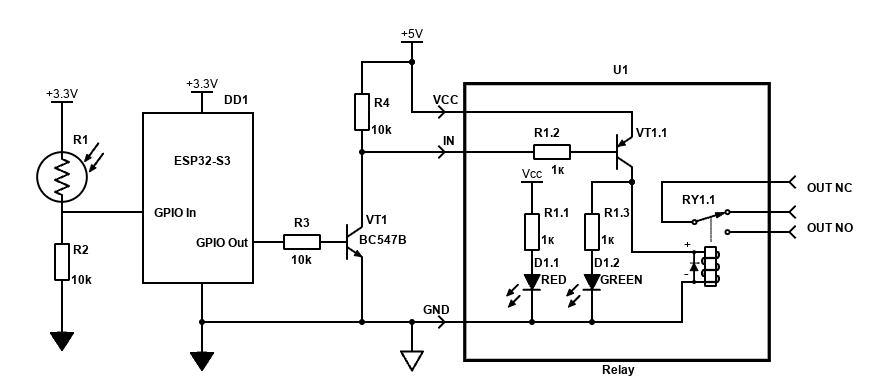

# <1.7>

> EMB_25 Мініпроєкт <1> підключення сенсора і актуатора, відладчик
> Мініпроєкт: Сутінковий перемикач на ESP32-S3


## Video Demo
TODO
<!-- 
<video controls width="600">
  <source src="./docs/Assignment_1.4.mp4" type="video/mp4">
  Your browser does not support the video tag.
</video> -->

### Схемотехніка

[Посилання на Діаграму](https://app.cirkitdesigner.com/project/93914e23-96de-43bc-9be2-04c2cfafc54f)



Зберіть схему на макетній платі згідно з наданим кресленням:

Вхід (Фоторезистор): Підключіть дільник R1(LDR) + R2 (10 кОм) до шини +3.3V. Точку з'єднання підключіть до GPIO In (ADC).

Ключ (Узгодження 3.3V -> 5V): Підключіть GPIO Out через R3 (10 кОм) до бази транзистора BC547B (VT1). Колектор підтягніть до +5V через R4(10 кОм) та підключіть до входу IN модуля реле.

Вихід (Навантаження): До контактів реле OUT NO підключіть будь-яке безпечне низьковольтне навантаження (світлодіод, LED-стрічку 5V/12V).

### Вимоги до програми (Код)
Напишіть просту програму, яка виконує 3 кроки у головному циклі:

Зчитати значення ADC з піна GPIO IN (діапазон 0...4095).

Порівняти значення з порогами (Гістерезис):

Якщо ADC < THRESHOLD_DARK (темно) -> подати HIGH на GPIO Out (увімкнути реле).

Якщо ADC > THRESHOLD_LIGHT (світло) -> подати LOW на GPIO Out (вимкнути реле).

Якщо значення між порогами -> нічого не змінювати (це захищає реле від брязкоту).

## Набір деталей

| Деталь | Опис |
|------|--------|
| Board | ESP32-S3 N16R8 (16 MB flash, 8 MB PSRAM) |
| Резистори | x3 10k Om |
| jqc3f-05vdc-c | 5V Реле x1 |
| 5В Плата живлення на бредборді | x1 | 

### Вихід програми 


## Швидкий старт

```bash
pio run                 # build
pio run -t upload       # flash
pio device monitor      # serial console @ 115200
```

## Notes (Debriefing)

## What I would add

## TODO
- [] Add hardware requirements
- [] Add circuit diagram 
- [x] Add code function comments
- [] Add debugging log (First no button activation at all, then wrong activation pattern due to pull-down misconfiguration)
