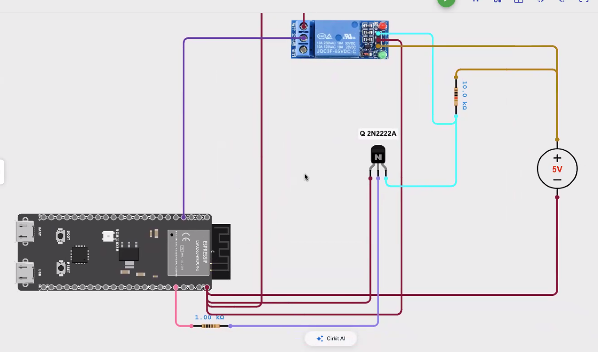

# <1.7>

> EMB_25 Завдання 2.2: Активні та Пасивні елементи
> Завдання 1: Вимірювання часу спрацювання реле


### Схемотехніка

[Посилання на Діаграму](https://app.cirkitdesigner.com/project/e458f877-0795-4711-978f-bc68a347a704)



[Вивід в консоль](output/2.2_output.log)
```
Цикл 2. Час OFF: 3677 мкс
Цикл 3. Час ON:  4517 мкс
Цикл 3. Час OFF: 3677 мкс
Цикл 4. Час ON:  4516 мкс
Цикл 4. Час OFF: 3675 мкс
Цикл 5. Час ON:  4521 мкс
Цикл 5. Час OFF: 3674 мкс
Цикл 6. Час ON:  4536 мкс
Цикл 6. Час OFF: 3671 мкс
Цикл 7. Час ON:  4526 мкс
Цикл 7. Час OFF: 3670 мкс
Цикл 8. Час ON:  4521 мкс
Цикл 8. Час OFF: 3669 мкс
Цикл 9. Час ON:  4541 мкс
Цикл 9. Час OFF: 3666 мкс
Цикл 10. Час ON:  4542 мкс
Цикл 10. Час OFF: 3665 мкс

====== ПІДСУМКИ ======

Середній час ON:  4562 мкс
Середній час OFF: 3672 мкс
======================
```

### Відео демонстрація
<video controls width="600">
  <source src="./output/Assignment_2.2.mp4" type="video/mp4">
  Your browser does not support the video tag.
</video>

### Вимоги до програми (Код)

Під'єднати реле до ESP32 та виміряти механічну затримку його спрацювання:

Один пін GPIO керує обмоткою реле (через модуль або транзистор).

Інший пін GPIO зчитує стан «сухого» контакту реле (використовуйте режим INPUT_PULLUP).

Для вимірювання часу використовувати micros() (або millis()) та переривання (attachInterrupt).

Увага: врахуйте механічний брязкіт контактів при спрацюванні переривання!

Провести не менше 10 вимірювань, вивести результати в Serial Monitor та порахувати середній час увімкнення/вимкнення.


## Набір деталей

| Деталь | Опис |
|------|--------|
| Board | ESP32-S3 N16R8 (16 MB flash, 8 MB PSRAM) |
| Резистори | x3 10k Om |
| 5V Реле x1 | jqc3f-05vdc-c |
| NPN Транзистор | 2Q 2N2222  |
| 5В Плата живлення на бредборді | x1 | 

### Вихід програми 

Вивід програми 


## Швидкий старт

```bash
pio run                 # build
pio run -t upload       # flash
pio device monitor      # serial console @ 115200
```

## Згенерувати плоти 

### Вимоги 
- Python 1.13.13
- pyserial 3.5
- matplotlib==

### Записати лог


Задайте шлях до логів

src\save_serial_output.py

```python
LOG_PATH = Path(__file__).parent / ".." / "dummy.log" # Шлях до логу
SERIAL_PATH = "COM16" # Порт UART (JTAG) на USB32, має співпадати з 
# platformio.ini: monitor_port = COM16
```
Видає тільки ./<logname>.log

### Візуалізувати вхід з ADC/ Вихід в Реле

src\save_serial_output.py

Задайте шлях до логів
```bash
LOG_PATH = Path(__file__).parent / ".." / "dummy.log" # Шлях до логу
SORTED_LOG_PATH = Path(__file__).parent / ".." / "sorted_dummy.log" # Лог з посортованою часовою шкалою (За Timestamp)
FIGURE_PATH = Path(__file__).parent / ".." / "adc_error_vs_voltage.png" # 3 Графіки - зберігаються у docs\plots\***\adc_error_vs_voltage.png
# Тип графіків (по вертикалі донизу)
#1 - Чистий вхід ADC / #2 - фільтрований EMA вхід ADC, / #3 Вихід на керування реле 
# Горизонтальним пунктиром обозначені ліміти THRESHOLD_DARK (Поріг ввимкнення), THRESHOLD_LIGHT - (Поріг ввімкнення)
```

## Notes (Debriefing)

## What I would add

## TODO
- [x] Add hardware requirements
- [x] Add circuit diagram 
- [x] Add code function comments
- [x] Add debugging log (First no button activation at all, then wrong activation pattern due to pull-down misconfiguration)
